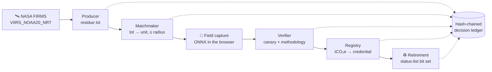
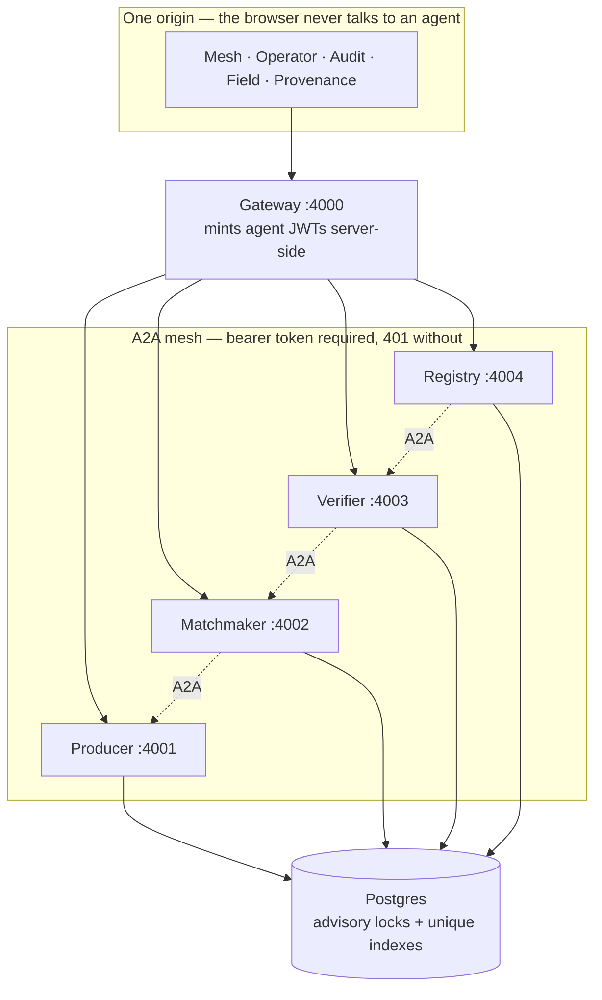

# Charkha

**Waste-to-Carbon-Value Chain Tracker** — HackOut'26, Circular Carbon Ecosystem.

Crop residue that would otherwise be burned is detected from satellite, routed to a
nearby conversion unit, verified in the field from a phone, and issued as a retirable
W3C Verifiable Credential. **One task id threads the whole chain.**

Detection is a solved problem. This is what happens *after* detection — and whether
anyone can check that it happened.

**Live:** <https://charkha-hashhawks.centralindia.cloudapp.azure.com>

| | |
|---|---|
| A2A agents | **4**, 7 skills, each with its own Agent Card and JWT auth |
| Tests | **344** across 28 files, 0 skipped |
| Production ledger | **67 records, chain valid** |
| Carbon factors | **4**, every one cited to IPCC 2019 Refinement |
| Evidence payload | **~699 bytes** — a hash, never an image |
| Languages | English, हिन्दी, ਪੰਜਾਬੀ, ગુજરાતી |
| Hosted AI calls | **0** — CI fails the build if one appears |

---


**New here?** [Who uses which screen, and in what order](docs/WHO-DOES-WHAT.md) — including the one question everybody asks first: how to get a match id.

## The chain



Every dotted line is one `appendDecision()` — exactly one row per meaningful decision,
append-only, `SHA256(prevHash + canonicalJson(body))`. Edit any row and the chain
breaks at that row and every row after it.

## Architecture



The field photo is scored by `onnxruntime-web` **on the device**. The server re-runs a
pseudo-random **canary tensor seeded from the image hash** through `onnxruntime-node`
and compares. Agreement on the deployed host: **~1e-9**. So the server never sees the
photo and can still prove you ran its exact model on it.

## What is real, and what is not

Stated plainly, because an overclaim a judge finds costs more than a limitation we
volunteer. The running system says the same thing on its **Provenance** screen, read
live from the services rather than typed by hand.

| | |
|---|---|
| A2A messaging, task lifecycle, Agent Cards | **real** — official SDK, validated by the A2A Inspector |
| Hash-chained decision ledger | **real** — serialised under a DB advisory lock, 50 concurrent appends tested |
| W3C Verifiable Credentials | **real** — locally generated `did:key`, signature checked in your browser |
| ONNX, two runtimes | **real** — one model file, agreement asserted by a parity test |
| Live satellite feed | **real** — NASA FIRMS, 5-day window, stated on screen |
| The area we cover | **partial** — we request a rectangle over India, and the subcontinent is not one. One box inside it (Sri Lanka) is dropped, listed with coordinates on Provenance; the rule is that no part of India lies inside a dropped box. **Not a border filter** — detections in Pakistan, Nepal and Myanmar stay, because any rectangle around them takes Indian land too |
| Agent-to-agent auth | **real** — unauthenticated call is refused 401 |
| One photo → one credit | **real** — unique index on `image_hash`; 5 concurrent claims leave 1 row |
| Char-quality model | **partial** — a documented colour heuristic, **not a trained classifier** |
| Retirement authorisation | **partial** — checks a holder field, not a signed presentation |
| Message queue | **partial** — in-memory behind a broker-shaped interface |
| Blockchain | **not used** — a hash chain gives tamper-evidence without a token or gas |
| Third-party security audit | **no** — we ran our own and it found a credential-forgery path, which we closed |

## Check it yourself

Nothing here needs our cooperation:

- **The chain** — Audit screen → *verify chain in this browser*. It re-hashes every record
  with the same function the server runs. Edit one and watch it break at exactly that row.
- **A credential** — decode the JWT, verify it against the issuer DID. Resolved locally;
  our database is never asked to vouch for itself.
- **Revocation** — read the bit your credential names in the published status list:
  [`/status/credits`](https://charkha-hashhawks.centralindia.cloudapp.azure.com/status/credits)
- **The photo never leaving** — open Field with the network tab recording. ~699 bytes, no image.
- **That it is really A2A** — point the official [A2A Inspector](https://github.com/a2aproject/a2a-inspector)
  at any agent. Not our code validating our own claim.

```bash
pnpm e2e https://charkha-hashhawks.centralindia.cloudapp.azure.com
```

Walks all 15 stages — detection, match, inference, verdict, credit, double-issuance
refusal, wrong-holder refusal, retirement, idempotent retirement, chain validity.

## Quick start

```bash
pnpm install
pnpm setup:env                 # writes .env with fresh random secrets
docker compose up -d db
pnpm db:push && pnpm seed
pnpm dev                       # agents + gateway + web
```

There are no default passwords in this repo on purpose — a default is a value that
quietly reaches a VPS. Free FIRMS key: <https://firms.modaps.eosdis.nasa.gov/api/map_key/>

Whole stack in containers, as the demo runs it:

```bash
docker compose up -d           # db, migrate, 4 agents, gateway, caddy
pnpm verify                    # lint, typecheck, 344 tests, web build
```

## Layout

| Path | What |
|---|---|
| `packages/core` | Contracts, hash chain, geo, carbon math — the only place a boundary type lives |
| `packages/a2a` | Agent server/client, Agent Cards, JWT, rate limiting |
| `packages/db` | Drizzle schema and the append-only ledger |
| `apps/gateway` | Single-origin API, trace assembly, serves the SPA |
| `apps/web` | Five views: Mesh, Operator, Audit, Field, Provenance |
| `agents/*` | producer, matchmaker, verifier, registry |
| `ml/` | Model contract, training and ONNX export |
| `docs/` | Deployment runbook and demo runbook |

Working rules, ownership and the testing bar: [`CLAUDE.md`](CLAUDE.md).

---

Built by **HashHawks** — [@CODER7657](https://github.com/CODER7657),
[@harshpansuriya71-sudo](https://github.com/harshpansuriya71-sudo),
[@Hem60](https://github.com/Hem60), [@Ayush3422](https://github.com/Ayush3422).
